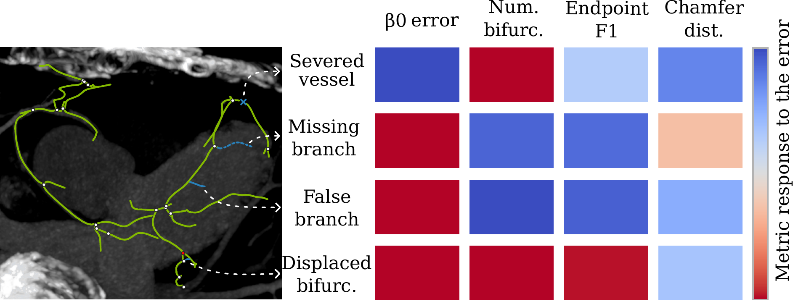

# ceval

Evaluation of centerline graphs. `ceval` compares a predicted centerline graph with a
reference graph and reports all metrics from the paper under one protocol:

- both graphs are densified so that no edge is longer than the matching tolerance `D`,
  before any metric is computed;
- the tolerance is recorded with every score.



*Different metrics respond to different errors (blue: the metric responds, red: it does not).
No single metric reports every error, which is why the choice of metrics matters.*

## Quick start (Docker)

```bash
docker build -t ceval .
docker run --rm -v "$PWD/examples:/data" ceval \
    /data/prediction.vtp /data/reference.vtp --d-mm 0.7 -o /data/report.json
```

`examples/` holds a small synthetic vessel tree (`reference.vtp`) and the same tree with one
branch removed (`prediction.vtp`). The report is written to `examples/report.json`.

## Output

By default the report gives one value per metric, grouped as in the paper. Geometric
descriptors (`Len_tot`, `Len_br`, `Ang_bif`, `tortuosity`) and `N_bif` are given as the
absolute difference between prediction and reference. Add `--long-report` to get every
metric with all its details (precision, recall, counts, values of both graphs).

## Your own data

`-o` sets the path of the JSON report; without it the report is printed to the screen. Paths
are inside the container, so mount the folder that holds your graphs, for example as `/work`:

```bash
docker run --rm -v "$PWD:/work" ceval \
    /work/pred.vtp /work/gt.vtp --d-mm 0.7 -o /work/results/case01.json
```

## Input

Two `.vtp` polyline files with node coordinates in millimetres. The tolerance is set with
`--d-mm` (we use the mean voxel diagonal of the image), or with `--dataset` for the datasets
used in the paper (`topcow_mr`, `topcow_ct`, `aortaseg24`, `imagecas`).

## Python

Run from the repository root:

```python
from ceval import build
from ceval.io import read_vtp_polylines
from ceval.report import summary

pred_pos, pred_edges = read_vtp_polylines("examples/prediction.vtp")
gt_pos, gt_edges = read_vtp_polylines("examples/reference.vtp")

report = build(pred_pos, pred_edges, gt_pos, gt_edges, d_mm=0.7)  # long report
short = summary(report)                                            # one value per metric

for group, metrics in short["metrics"].items():
    print(group)
    for name, value in metrics.items():
        print(f"  {name:<20s} {value}")
```

Output:

```
tolerance_based
  node_F1              0.9114
  edge_m2m_F1          0.9143
  cl_coverage          0.9145
  cov_len              0.8447
  branch_coverage_F1   0.9231
  overlap_first_error  0.8451
  branch_continuity    0.8725
  junction_F1          0.8
  endpoint_F1          0.8889
distance_based
  node_chamfer         0.4379
  node_HD95            4.5872
  SMD                  0.4293
  APLS                 0.779
structural_counts
  beta0_err            0.0
  beta1_err            0.0
  N_bif                1.0
  branch_count_ratio   0.2857
geometric
  Len_tot              14.1421
  Len_br               2.0152
  Ang_bif              0.0
  tortuosity           0.0
```

`pred_pos` and `gt_pos` are `(N, 3)` arrays in mm, `pred_edges` and `gt_edges` are `(E, 2)`
arrays of node indices. `report` holds the long report (the same as `--long-report`).

## Recommended metrics

We recommend reporting **SMD**, **endpoint F1** and **total length** (`Len_tot`), together with
the structural counts (`beta0_err`, `beta1_err`, `N_bif`, `branch_continuity`) that the clinical
question depends on.

## License

MIT, see [LICENSE](LICENSE).
